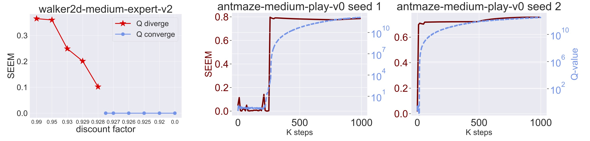
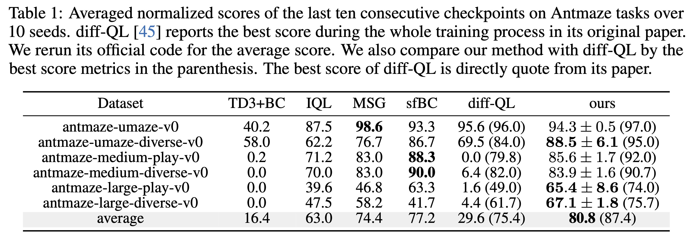
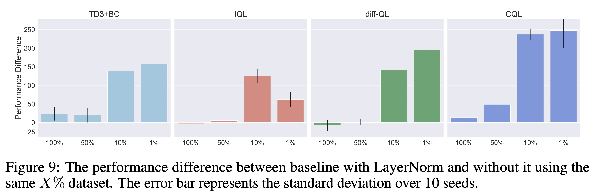

# SEEM: Understanding, Predicting and Better Resolving Q-Value Divergence in Offline-RL

Official code of the following paper:

[Understanding, Predicting and Better Resolving Q-Value Divergence in Offline-RL](TO BE FILLED).

## Main Results




## SEEM Metrics and Mujoco
Please checkout to `td3` branch by
```
git checkout td3
```


## Antmaze
Before you start, install Jax and dependencies by running
```
pip install -r requirements.txt
```
Next, we use SLURM gpu resource allocation system to lauch jobs. First, create a directory namely `slurm_batch`. You can reproduce the results in Table 1 by running:
```
ALGO=diff-TD3 REW_SCALE=10.0 TASK=antmaze QF_LAYER_NORM=True bash scripts/launch_job_slurm.sh
```
Note: If you want to run in local machines, just comment Line 44 in `scripts/launch_job_slurm.sh`.Create a directory namely `slurm_batch`. Then the generated commands will be stored in the directory `slurm_batch`. You can run the bash scripts locally.

Note: You can reproduce the results without OPER-R in Table 2 by set `oper=False` and `two_sampler=False` in `diffusion/hps.py`.

You can run ablation study regarding LayerNorm in Table 5 by running:
```
ALGO=diff-TD3 REW_SCALE=10.0 TASK=antmaze QF_LAYER_NORM=True LAYER_NORM_INDEX=0 bash scripts/launch_job_slurm.sh
ALGO=diff-TD3 REW_SCALE=10.0 TASK=antmaze QF_LAYER_NORM=True LAYER_NORM_INDEX=0,1 bash scripts/launch_job_slurm.sh
...
```


## Weights and Biases Online Visualization Integration
This codebase can also log to [W&B online visualization platform](https://wandb.ai/site). To log to W&B, you first need to set your W&B API key environment variable.
Alternatively, you could simply run `wandb login`.

## Credits
Implementation of Diffusion-QL heavily borrows from this [Jax Diffusion-QL implementation](https://github.com/sail-sg/edp/blob/main/README.md).


## Note
The code in this repository has been reorganized. Errors that may arise during the organizing process could lead to code malfunctions or discrepancies from the original research results. If you encounter any problems, please raise issues. I will go and fix these bugs.

## Bitex
```
TBD
```
